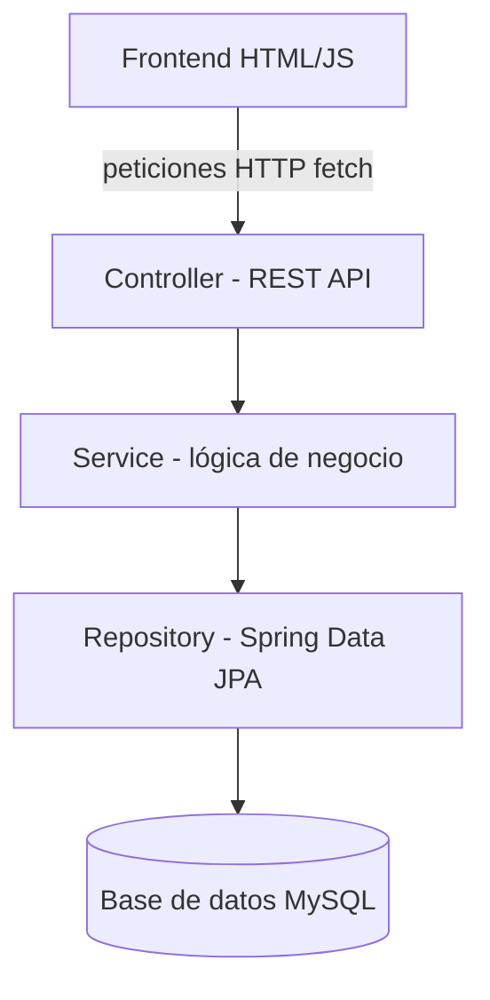
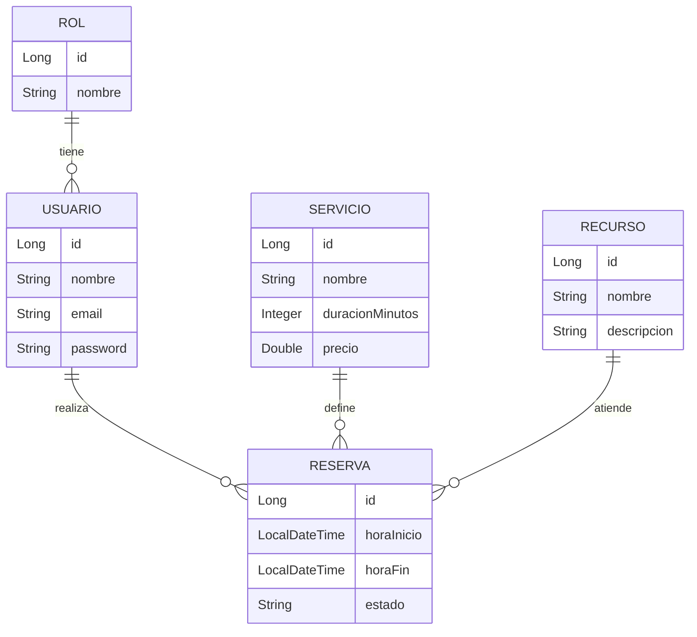

# Sistema de Reservas

Proyecto de portafolio: sistema web genérico de reservas/turnos con múltiples
usuarios, control de conflictos de horario y autenticación JWT.

## Arquitectura

Misma arquitectura en capas que los dos proyectos anteriores del portafolio:



## Modelo de datos



- **Usuario** — pertenece a un **Rol** (ADMIN o CLIENTE)
- **Servicio** — lo que se reserva (nombre, duración en minutos, precio)
- **Recurso** — genérico a propósito: puede ser un profesional, una mesa, un
  consultorio, una cancha — lo que el negocio necesite reservar
- **Reserva** — usuario + servicio + recurso + hora de inicio/fin + estado (CONFIRMADA/CANCELADA)

## La regla de negocio central: detección de conflictos de horario

En `ReservaRepository.buscarConflictos()` hay una consulta JPQL que detecta si
dos intervalos de tiempo se traslapan, usando la fórmula estándar:

```
r.horaInicio < fin_nueva  AND  r.horaFin > inicio_nueva
```

En palabras simples: una reserva existente choca con la nueva si **empieza antes
de que la nueva termine** y **termina después de que la nueva empieza**. Cualquier
otro caso (una termina justo cuando la otra empieza, o no se tocan) no es conflicto.

En `ReservaService.crearReserva()`:
1. Calcula la hora de fin sumando la duración del `Servicio` a la hora de inicio
2. Busca conflictos para ese `Recurso` en ese rango
3. Si encuentra alguno, lanza `ConflictoHorarioException` — **la reserva se
   bloquea por completo**, a diferencia del proyecto de finanzas (que solo
   alertaba). Aquí sí tiene sentido bloquear: dos reservas del mismo recurso al
   mismo tiempo simplemente no pueden coexistir.
4. El `GlobalExceptionHandler` convierte esa excepción en un `409 Conflict` —
   el código HTTP diseñado exactamente para este tipo de error.

**Punto para destacar en una entrevista:** los tres proyectos del portafolio manejan
sus reglas de negocio de forma distinta a propósito — bloqueo total (inventario),
solo alerta (finanzas), bloqueo por conflicto de recursos (reservas). Muestra que
la solución se piensa según el dominio, no se copia igual en todos lados.

## Seguridad

Mismo patrón BCrypt + JWT de los proyectos anteriores.
- Público: `POST /api/usuarios/login`, `POST /api/usuarios/registro`
- Todo lo demás requiere `Authorization: Bearer <token>`

## Estructura de carpetas

```
reservas-app/
├── backend/
│   └── src/
│       ├── main/java/com/reservas/
│       │   ├── model/         → Usuario, Rol, Servicio, Recurso, Reserva, EstadoReserva
│       │   ├── repository/    → incluye la query de conflictos de horario
│       │   ├── service/       → validación de conflictos
│       │   ├── controller/    → endpoints REST
│       │   └── config/        → seguridad y manejo de errores
│       └── test/java/com/reservas/service/
│           └── ReservaServiceTest.java  → 5 casos con Mockito
├── frontend/
│   ├── index.html       → login
│   ├── reservas.html    → crear/cancelar reservas
│   └── js/api.js
└── database/
    └── schema.sql
```

## Cómo correrlo

1. Crea la base de datos: `CREATE DATABASE reservas_db;`
2. Edita `backend/src/main/resources/application.properties` con tu usuario/password de MySQL
3. Desde `backend/`: `mvn spring-boot:run` — levanta en `http://localhost:8082`
   (puerto distinto a inventario `8080` y finanzas `8081`, para correr los tres a la vez)
4. Registra un usuario con `POST /api/usuarios/registro`
5. Abre `frontend/index.html`

## Endpoints principales

| Método | Ruta                              | Qué hace                                  |
|--------|-------------------------------------|---------------------------------------------|
| POST   | /api/usuarios/registro              | Crea usuario                                |
| POST   | /api/usuarios/login                  | Login, devuelve token JWT                    |
| GET    | /api/servicios                       | Lista servicios disponibles                  |
| GET    | /api/recursos                        | Lista recursos disponibles                   |
| POST   | /api/reservas                        | Crea reserva (valida conflictos, 409 si choca) |
| PUT    | /api/reservas/{id}/cancelar         | Cancela una reserva                           |
| GET    | /api/reservas/usuario/{usuarioId}   | Reservas de un usuario                        |
| GET    | /api/reservas/recurso/{recursoId}   | Reservas de un recurso (para ver su agenda)   |

## Tests

`mvn test` desde `backend/`. Cubre: reserva sin conflictos, reserva que choca
con otra existente, reserva justo después de que termina otra (no es conflicto),
servicio inexistente, y cancelación de reserva.

## Próximos pasos sugeridos

- Endpoint para ver la disponibilidad de un recurso en un rango de fechas
  (útil para mostrar un calendario en el frontend)
- Notificaciones (recordatorio antes de la hora de la reserva)
- Reglas de horario de atención (que no se pueda reservar fuera del horario del negocio)
